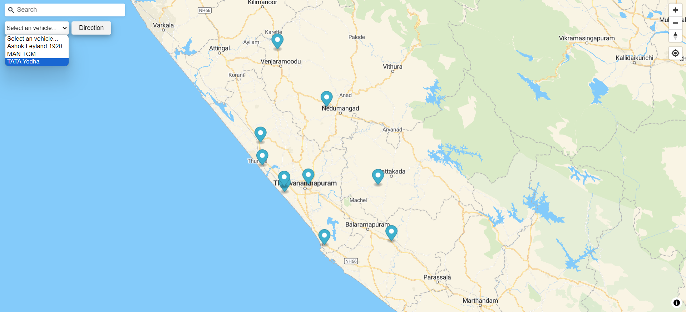
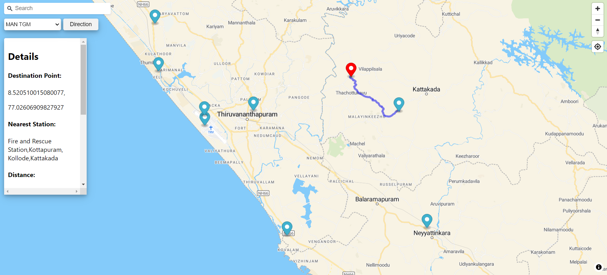

# RescueRoute 

## Intruduction

RescueRoute is web map which finds optimal route between two points by also considering the vehicle size and road width. 
This can be used by fire force for finding the best route to reach to place of need with the fire engine of choice. This can solve the problem being stuck half way when going to a place of emergency due to the road size limitations.




## Features

- Can Search places by name or coordinates.
- Shows location of fire stations as a marker on map.
- Can select different fire engines from select menu.
- Live location and tracking.
- Calculate optimal and feasible route for a select fire engine.
- Shows route details like time of travel, distancce of travel, remaining distance which can't be covered by fire engine. 

## Installation

### User Side Hosting

- For the user side hosting, you need Node JS v16 or above because it is uses vite React.
- For installation, refer the [nodejs site](https://nodejs.org/en/download/package-manager).

### Server Side Hosting

- For the server side hosting, python and mysql is required.
- For windows, you can download their setup from [python](https://www.python.org/downloads/) and [mysql](https://dev.mysql.com/downloads/installer/) site.
- For ubuntu, installation steps are in shown in the following sites:
    - [ ] [Python](https://www.digitalocean.com/community/tutorials/how-to-install-python-3-and-set-up-a-programming-environment-on-an-ubuntu-20-04-server)
    - [ ] [MySQL](https://ubuntu.com/server/docs/install-and-configure-a-mysql-server)

## Usage

- Clone the repository to your local machine.

### User Side Hosting

- Open the terminal in the frondend folder in project directory.
- Run this command to create the `node_modules` folder:
```
npm install
```
- Now we need to install all the dependencies which are mentioned in the `dependencies.txt` file in the project directory.
- For that run the following command:
```
npm i <dependency_name>
```
- Now to host the user side, run the command:
```
npm run dev
```
- Now you can access the user side from the link: `http://localhost:5173/`
- There may be change in the link, so check the terminal after running the above command.

### Server Side Hosting

- Open the terminal in the backend folder in project directory.
- Run this command to create the `venv` folder:
```
python -m venv venv
```
- Now we need to install all the packages which are mentioned in the `dependencies.txt` file in the project directory.
- For that run the following command:
```
pip install <package_name>
```
- Now to host the server side, run the command:
```
flask run
```
- can add `--debug` at the end for debugging purpose.
- Now you can access the server side from the link: `http://localhost:5000/`
- There may be change in the link, so check the terminal after running the above command.

#### Database setup

- We need to setup the databases for list of fire stations and the fire engines.
- For that, we need to create the database as:
    - [ ] host: "localhost"
    - [ ] user: "root"
    - [ ] password: "root"
    - [ ] database: "fire_station"
- The tables for fire station is "stations" and for fire engines is "engines".
- The tables are created using the following sql commads:
```
create table stations(
    station_id int primary key auto_increment,
    name varchar(255) not null,
    coordinates point not null
);

create table engines(
    vehicle_id int primary key auto_increment,
    name varchar(255) not null,
    width decimal(5,2) not null
);
```
- Use this command to add data to the tables:
```
insert into (name, coordinates) values (<station_name>,<station_coordinates>);
insert into (name, width) values (<engine_name>,<engine_width>);
```
- If you are changing anything in the above, you also need to change it in the `engine_db.py` and `station_db.py` files in the `backend` folder.

## Working

### User Side 

- The user side is the front end of the application. It is built using the `React`.
- The server sends the fire station and fire engine data to user side on load.
- Take all the coordinates from the fire station data and mark it on the map as blue markers.
- Use the fire engine data to create a select menu. 
- The user can select the destination point and fire engine.
- When pressed `Direction` button, user side identify the nearest fire station and sends the destination location, station location, and width of selected fire engine.
- The server sends back data including optimal route, distance of travel, time of tracel.
- Then all these details are shown on the map.

### Server Side

- Server has two main funtion.
    - extracting data from database and send it to user side.
    - recieve the coordinates and width from user side, calculate and send the optimal route to user side.
- Server can get the road network data from the `data` folder or can use get_data() funtion in the pyrosm package.
- The server extract road network data to edges and nodes.
- Check it has values int the field required (max_speed, width) and if not add defualt values to it.
- Values for the above fields should be in **numbers**.
- Then it filters out all the edges with width more than that of the fire engine's width.
- Then it calculates the shortest path between the two points.
- Then send this route to the user side.